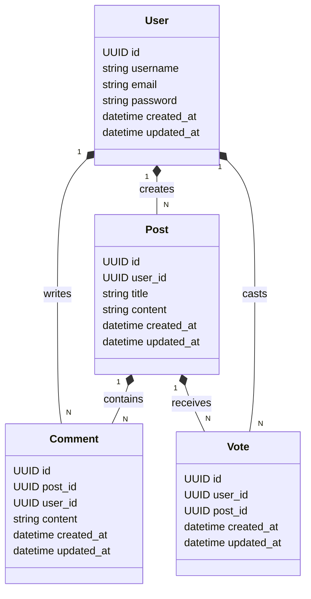

# Spring Forum 

This project is a simple forum application built with Spring Boot. It allows users to create posts, comment on posts, and vote on posts.

## Features

The application includes the following functionalities:

- User registration and login
- Post creation, editing, and deletion
- Comment creation, editing, and deletion
- Voting on posts

## ERD Diagram

The following Entity-Relationship Diagram (ERD) shows the relationships between the entities in the application:

## Contributing

Contributions are welcome! Please fork the repository and submit a pull request with your changes.

## License

This project is licensed under the MIT License - see the [LICENSE](./LICENSE) file for details.
