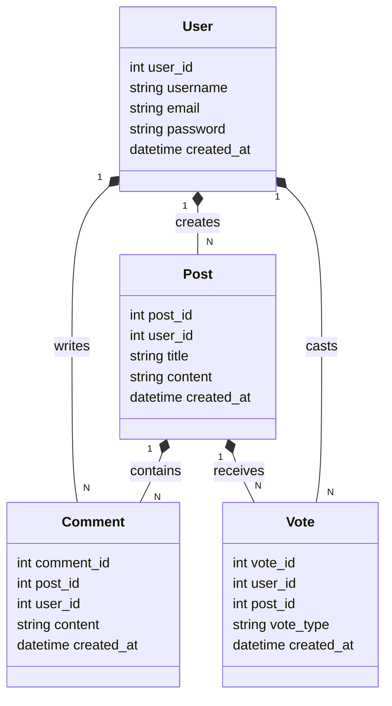

# Spring Forum 

```mermaid
classDiagram
    class User {
        int user_id
        string username
        string email
        string password
        datetime created_at
    }
    
    class Post {
        int post_id
        int user_id
        string title
        string content
        datetime created_at
    }
    
    class Comment {
        int comment_id
        int post_id
        int user_id
        string content
        datetime created_at
    }
    
    class Vote {
        int vote_id
        int user_id
        int post_id
        string vote_type
        datetime created_at
    }

    User "1" *-- "N" Post : creates
    Post "1" *-- "N" Comment : contains
    User "1" *-- "N" Comment : writes
    User "1" *-- "N" Vote : casts
    Post "1" *-- "N" Vote : receives
```