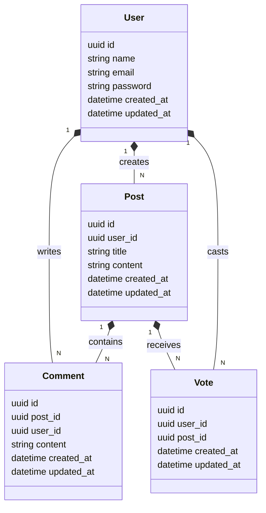

# Spring Forum 

This project is a simple forum application built with Spring Boot. It allows users to create posts, comment on posts, and vote on posts.

## Table of Contents

- [Getting Started](#getting-started)
- [Features](#features)
- [ERD Diagram](#erd-diagram)
- [Contributing](#contributing)
- [License](#license)

## Getting Started

### Running with Docker

The easiest way to run the application is with Docker.

```bash
docker-compose up -d
```

> The application will be available at [http://localhost:8080](http://localhost:8080).

### Running with Gradle

Alternatively, you can run the application with Gradle. 

#### Prerequisites

- Java 22 or later (it's compatible with Java 17, but you may need to update the `sourceCompatibility` and `targetCompatibility` in the `build.gradle` file)
- Gradle 8.0 or later

```bash
./gradlew bootRun
```

> The application will be available at [http://localhost:8080](http://localhost:8080).

## Features

The application includes the following functionalities:

- User registration and login
- Post creation, editing, and deletion
- Comment creation, editing, and deletion
- Voting on posts

## ERD Diagram

The following Entity-Relationship Diagram (ERD) shows the relationships between the entities in the application:



## Contributing

Contributions are welcome! Please fork the repository and submit a pull request with your changes.

## License

This project is licensed under the MIT License - see the [LICENSE](./LICENSE) file for details.
